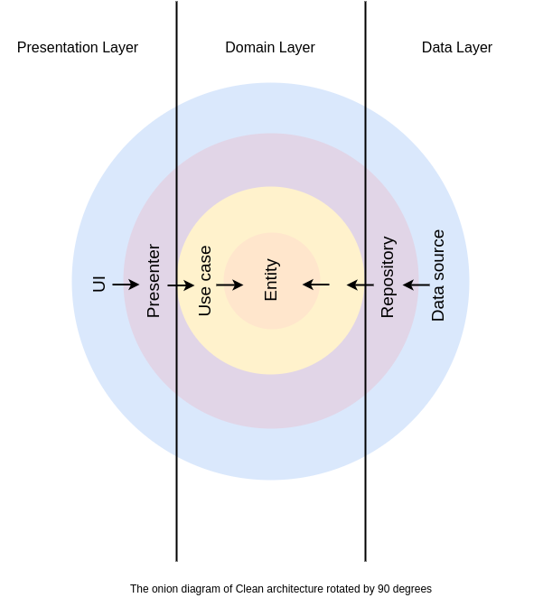
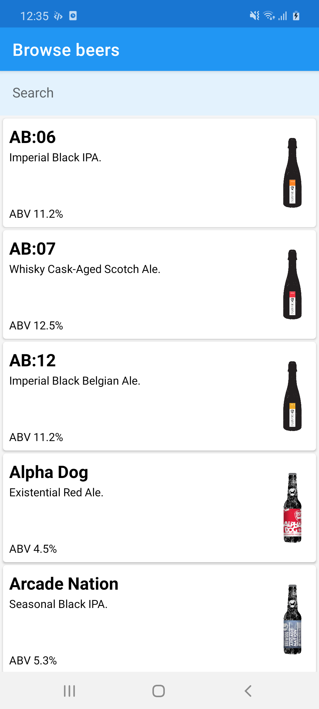
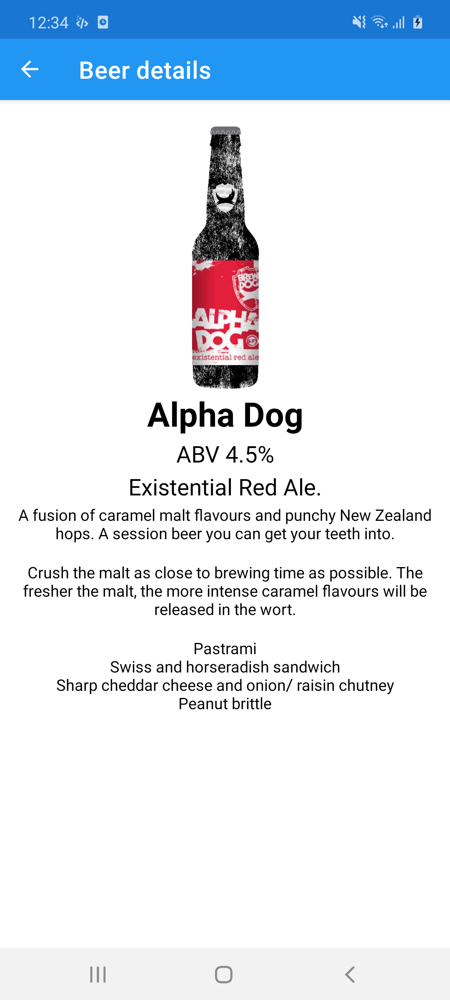
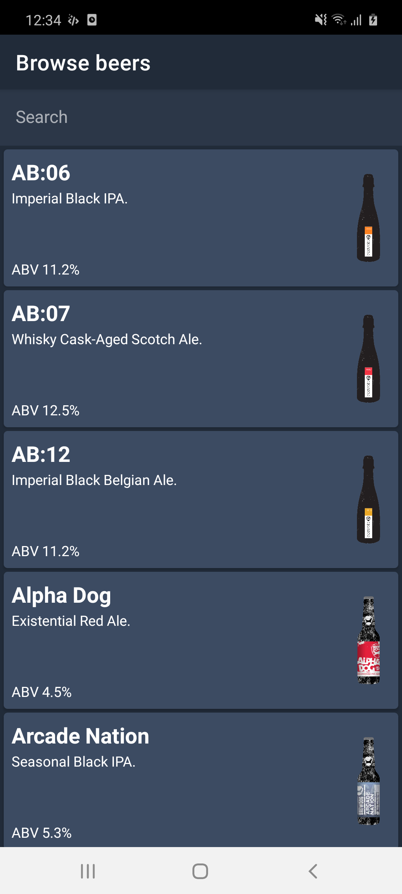
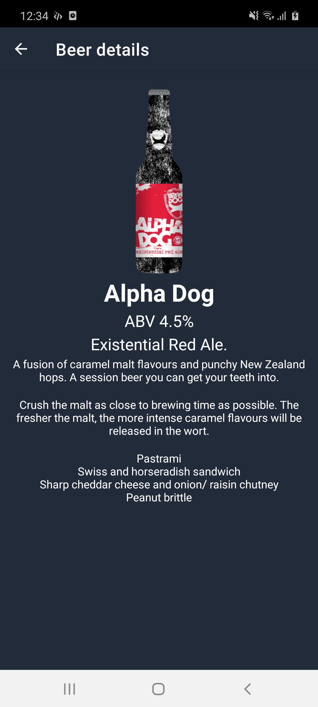

# Beer!

Now that I have your attention, this is a simple project to showcase the design, architecture and implementation of a multi-module Android app. This project is a list-details app which displays a list of Brewdog beers fetched from the [Punk Api](https://punkapi.com/) and presents the beer details when the user taps on a beer in the list. 

## Features
Although the app is a sample app, it supports some really nice features that are essential for the best user exeprience:
* **Offline mode**: A local database is used to cache the data
* **Portrait/Landscape mode**: Use of lifecycle aware `LiveData` which survive configuration changes
* **Filtering the list on the beer names**: The user can filter results by typing in a search EditText. `Flow` and `debounce()` is used in order to avoid triggering the search query with every keystroke
* **Pull to refresh data**: Use of `SwipeToRefreshLayout` to trigger fresh data fetching
* **Shared element transitions**: Applying transition names to views and pass the data on navigation. Also the animations are postponed until the target screen data are fetched
* **Day/Night mode**: A different theme for day and night mode

## Requirements
* JDK 1.8
* Android SDK
* min Android 7.1 (API 25) 
* Latest Android SDK Tools and build tools.

The app has one flavor(prod) to showcase how to implement different flavors pointing to different environments.

Install to a device using gradle:
```
./gradlew installProdDebug
```
## Architecture

The architecture used for this project is the **Clean Architecture**. This architecture maximizes the use of SOLID principles separating the responsibilities of the codebase and it clearly abstracts the logic of the actions that can be performed in the app. The architecture does not define exact layers but instead lays out the foundation. For the needs of this project three layers were used:

* **Presentation** User Interface and presentation layer using the MVVM pattern. Presentation Layer depends on the Domain Layer.
* **Domain** Business logic, domain models and repository interfaces required to cross boundaries. It has no Android dependencies, and it can be reused in other projects.
* **Data** Data handling and communication with data sources using the repository pattern. It supports a REST Api remote data source and a SQL database local data source needed for offline mode. Data Layer depends on Domain Layer.


<p align="center">
  
</p>
All the layer dependencies directly or indirectly point towards to the Domain layer, which is platform agnostic. Data are mapped to/from models of different layers. A typical flow in this architecture is:

1. UI calls a method from ViewModel
2. ViewModel executes a Use case
3. Use case combines data from one or more repositories
4. Each repository returns data from one or more data sources (Local or Remote)
5. Information flows back to the UI where we display the data

Let's look at each of the architecture layers and the role each one plays:

### Presentation
This layer makes use of the Android Framework and is responsible to create and render all of our UI components to display on the screen. We have two fragments representing the screns of the app,  [BrowseFragment](https://github.com/alexandrosbentevis/clean-arch-beer/blob/master/app/src/main/java/com/alexandrosbentevis/beer/features/browse/BrowseFragment.kt) and [DetailsFragment](https://github.com/alexandrosbentevis/clean-arch-beer/blob/master/app/src/main/java/com/alexandrosbentevis/beer/features/details/DetailsFragment.kt). Observers defined in the [BrowseFragment](https://github.com/alexandrosbentevis/clean-arch-beer/blob/master/app/src/main/java/com/alexandrosbentevis/beer/features/browse/BrowseFragment.kt) listen for changes in lifecycle aware `LiveData` from the [BrowseViewModel](https://github.com/alexandrosbentevis/clean-arch-beer/blob/master/app/src/main/java/com/alexandrosbentevis/beer/features/browse/BrowseViewModel.kt). 

The ViewModel executes the [GetAllBeersUseCase](https://github.com/alexandrosbentevis/clean-arch-beer/blob/master/domain/src/main/java/com/alexandrosbentevis/domain/usecases/GetAllBeersUseCase.kt) and maps the results in a list of [BeerUiModel](https://github.com/alexandrosbentevis/clean-arch-beer/blob/master/app/src/main/java/com/alexandrosbentevis/beer/features/browse/BeerUiModel.kt)s wrapped into a [UiState](https://github.com/alexandrosbentevis/clean-arch-beer/blob/master/app/src/main/java/com/alexandrosbentevis/beer/framework/UiState.kt). The [UiState](https://github.com/alexandrosbentevis/clean-arch-beer/blob/master/app/src/main/java/com/alexandrosbentevis/beer/framework/UiState.kt) is a sealed class reprersenting different states of the UI (`Loading`, `Empty`, `Success` and `Failure`). Errors are shown in the UI in the form of a `Toast`.

The same logic is followed for the [DetailsFragment](https://github.com/alexandrosbentevis/clean-arch-beer/blob/master/app/src/main/java/com/alexandrosbentevis/beer/features/details/DetailsFragment.kt). 

The [MainActivity](https://github.com/alexandrosbentevis/clean-arch-beer/blob/master/app/src/main/java/com/alexandrosbentevis/beer/MainActivity.kt) observes the network status from the [NetworkStatusViewModel](https://github.com/alexandrosbentevis/clean-arch-beer/blob/master/app/src/main/java/com/alexandrosbentevis/beer/framework/NetworkStatusViewModel.kt) and shows a red banner if there is no internet connection. The network states are provided by the [NetworkStatusProvider](https://github.com/alexandrosbentevis/clean-arch-beer/blob/master/app/src/main/java/com/alexandrosbentevis/beer/framework/NetworkStatusProviderImpl.kt) using `Flow`.

### Domain
The domain layer contains the use case instances used to retrieve data from the Data layer and pass it onto the Presentation layer. Presentation and Data layers are less important since they are only implementations that can be easily replaced. In our case, two use cases [GetAllBeersUseCase](https://github.com/alexandrosbentevis/clean-arch-beer/blob/master/domain/src/main/java/com/alexandrosbentevis/domain/usecases/GetAllBeersUseCase.kt) and [GetBeerUseCase](https://github.com/alexandrosbentevis/clean-arch-beer/blob/master/domain/src/main/java/com/alexandrosbentevis/domain/usecases/GetBeerUseCase.kt) are defined which request data from the [BeerRepository](https://github.com/alexandrosbentevis/clean-arch-beer/blob/master/domain/src/main/java/com/alexandrosbentevis/domain/repositories/BeerRepository.kt) interface. The [GetAllBeersUseCase](https://github.com/alexandrosbentevis/clean-arch-beer/blob/master/domain/src/main/java/com/alexandrosbentevis/domain/usecases/GetAllBeersUseCase.kt) uses a search query parameter to filter the results by name. The data returned are wrapped in a [Result](https://github.com/alexandrosbentevis/clean-arch-beer/blob/master/domain/src/main/java/com/alexandrosbentevis/domain/framework/Result.kt) which can be `Success` or `Error`.

The layer also defines the [Beer](https://github.com/alexandrosbentevis/clean-arch-beer/blob/master/domain/src/main/java/com/alexandrosbentevis/domain/models/Beer.kt) domain model. However, no model mappers are defined here, since this layer is the central layer of the architecture. Practically it knows nothing about the layers outside so it has no need to map data to any other type of model.

The Domain layer defines the [BeerRepository](https://github.com/alexandrosbentevis/clean-arch-beer/blob/master/domain/src/main/java/com/alexandrosbentevis/domain/repositories/BeerRepository.kt) interface which provides a set of methods for an external layer to implement. Both use cases are using this interface when requesting data. This abstraction and its binding is the application of the Dependency Inversion principle, decoupling the code modules.

### Data
The Data layer is the access point to external data layers and is used to fetch data from multiple sources (the local database and the network). It defines the [BeerRepositoryImpl](https://github.com/alexandrosbentevis/clean-arch-beer/blob/master/data/src/main/java/com/alexandrosbentevis/data/repositories/BeerRepositoryImpl.kt) which is the implementation of the [BeerRepository](https://github.com/alexandrosbentevis/clean-arch-beer/blob/master/domain/src/main/java/com/alexandrosbentevis/domain/repositories/BeerRepository.kt). No further abstractions are needed for the data sources, since [BeerDao](https://github.com/alexandrosbentevis/clean-arch-beer/blob/master/data/src/main/java/com/alexandrosbentevis/data/datasources/local/dao/BeerDao.kt) provided by `Room` and [BeerApi](https://github.com/alexandrosbentevis/clean-arch-beer/blob/master/data/src/main/java/com/alexandrosbentevis/data/datasources/remote/BeerApi.kt) provided by `Retrofit`  are suitable for this role, hiding the implementation details.

The [BeerRepositoryImpl](https://github.com/alexandrosbentevis/clean-arch-beer/blob/master/data/src/main/java/com/alexandrosbentevis/data/repositories/BeerRepositoryImpl.kt) uses a mechanism to fetch the data from the data sources. The database is the only source of truth in this mechanism and executes queries for filtering and sorting the data, since we do not have control over a third-party api like the [Punk Api](https://punkapi.com/).

The Data fetch flow defined as the extension function [emitData()](https://github.com/alexandrosbentevis/clean-arch-beer/blob/master/data/src/main/java/com/alexandrosbentevis/data/extensions/FlowExtensions.kt) works like this:
1. Fetch the data from the database (filtered and sorted) if present. Pass them as a flow back to the ui
2. Fetch the data from the api and replace the database table with fresh data
3. Fetch the fresh data from the database again (filtered and sorted)
4. If they are different from the initial data, pass them as a flow back to the ui

If the user refreshes the data from the `SwipeRefreshLayout` in the UI, a `forceRefresh` flag is passed from the ViewModel all te way to the Repository and Step 1 is skipped.

The models of the data layer are [BeerEntity](https://github.com/alexandrosbentevis/clean-arch-beer/blob/master/data/src/main/java/com/alexandrosbentevis/data/datasources/local/models/BeerEntity.kt) for the local data source and [BeerDto](https://github.com/alexandrosbentevis/clean-arch-beer/blob/master/data/src/main/java/com/alexandrosbentevis/data/datasources/remote/models/BeerDto.kt) for the remote. This layer also defines mappers to domain layer models.

## Module structure
The app consists of three modules with well-defined boundaries around each one which represent the layers of the architecture: 

* `app(android module)` The presentation layer (MVVM pattern using `LiveData`)
* `domain(kotlin module)` The domain layer (business models and use cases using `Flow`) 
* `data(android module)` The data layer (remote/local data sources and repository pattern suing `Flow`)

Such a modular architecture also helps keeping unrelated classes decoupled and provides a natural structure of the codebase.

## Libraries

* **View-Binding**: Accessing xml views
* **Hilt**: Dependency Injection framework
* **ViewModel**: MVVM pattern component 
* **Kotlin-Coroutines-Flow**: For asynchronous tasks, reactive programming
* **Android Jetpack Navigation**: Screen navigation
* **Retrofit**: REST Api client
* **Picasso** - Image loading
* **Room**: SQL database storage library 
* **Junit, Mockito, MockWebServer, Espresso, Barista, Turbine** - Unit and Instrumentation testing

## Testing

The architecture of the app makes it very easy to test each component independently. Each module contains unit tests using mocks. In mock testing, the dependencies are replaced with objects that simulate the behaviour of the real ones.

For the ui, instrumentation tests are written that run on physical devices and emulators and they can take advantage of the Android framework APIs.

Using gradle to run the tests:

```
./gradle test // unit tests
./gradlew connectedAndroidTest // instrumentation tests
```

## Future improvements

This project is just a small project to demonstrate the design, architecture and implementation of a modern app. A production-ready app with more features would be more complex than this. The architecture could be more complicated having more modules, for example separating the `app` moudule into `ui` and `presentation` or having separate modules for the data sources.

To showcase result filtering I filter the results using a search query on the beer name. A real world application would probably require more complicated filters and sorting (ie on more than one fields of the beer model).

An improvement on testing the api would be implementaing a `Dispatcher` which would dispatch mock responses for the `MockWebServer` according to different paths of the Rest API. In the current implementation, the mock responses for each test are enqueued in every test method.

 
## App screenshots

### Day mode

<p>


</p>

### Night mode

<p>


</p>